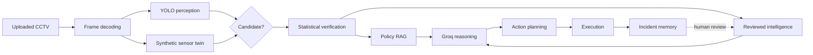
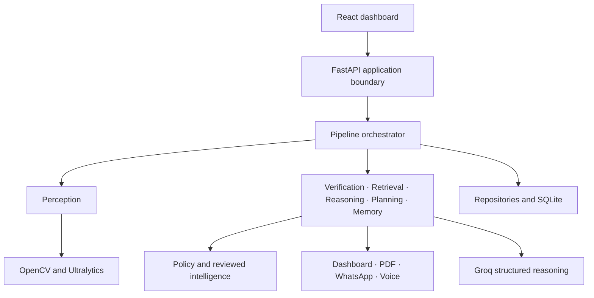
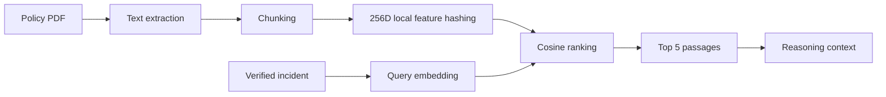

<div align="center">

# Sentrix

### Observe. Verify. Understand. Respond.

**A context-aware, risk-aware AI surveillance framework that turns CCTV footage into an explainable, policy-grounded response.**

[](https://python.org)
[](https://fastapi.tiangolo.com)
[](https://react.dev)
[](https://typescriptlang.org)

[Pipeline](#the-sentrix-pipeline) · [Mathematics](#verification-mathematics) · [Quick start](#quick-start) · [Demo](#demo-walkthrough) · [Documentation](#documentation)

</div>

---

> [!IMPORTANT]
> Sentrix performs **real video decoding and configured YOLO inference**. Because the demo has no physical smoke or microphone hardware, smoke and audio are generated by a clearly labelled **synthetic sensor twin**, one synchronized reading per decoded frame. Alert delivery can be simulated or connected to live providers.

## Why Sentrix?

Traditional CCTV produces detections. It rarely explains whether a detection is credible, which policy applies, whether a similar incident was reviewed before, or why a particular response was chosen.

Sentrix turns surveillance into an auditable decision pipeline:

- **Observe** uploaded footage frame by frame.
- **Verify** visual evidence against smoke and audio signals.
- **Retrieve** organization policy and relevant reviewed incidents.
- **Reason** over evidence, policy, contacts, and learned intelligence.
- **Plan** a proportional action: call, message, or no escalation.
- **Execute** alerts and create a PDF incident report.
- **Remember** the decision and later human review.

## At a glance

| Capability | What Sentrix does |
|---|---|
| Video perception | Decodes footage with OpenCV and runs the configured Ultralytics model |
| Sensor twin | Generates synchronized smoke and audio readings for every frame |
| Verification | Fuses evidence with reliability, freshness, agreement, contradiction, and overrides |
| Dynamic threshold | Learns small, bounded adjustments from reviewed incidents |
| Policy RAG | Extracts PDFs, embeds locally, and retrieves relevant passages |
| Reviewed memory | Uses the single strongest similar reviewed incident |
| Agent reasoning | Uses Groq for validated, structured decisions |
| Execution | Supports dashboard alerts, reports, Vonage WhatsApp, and Twilio voice |
| Reconstruction | Replays mathematics, retrieval, reasoning, action, and memory visually |
| Guided demo | Sia narrates each stage locally without another API |

## The Sentrix pipeline



Every stage has one responsibility and emits structured, testable audit data.

### What happens during a scan

1. An operator uploads CCTV footage and selects a camera location.
2. OpenCV creates a timestamped frame stream.
3. YOLO evaluates visual accident evidence.
4. The sensor twin creates smoke and audio probabilities per frame.
5. Any modality can nominate an incident candidate.
6. Verification combines probability, reliability, freshness, and consistency.
7. A bounded adaptive threshold and guarded overrides decide whether it is verified.
8. Local RAG retrieves relevant policy passages.
9. Memory selects only the highest-similarity reviewed incident.
10. Groq returns structured severity, rationale, and action.
11. Execution produces delivery outcomes and a PDF report.
12. The complete record is stored for reconstruction and future learning.

## Architecture



| Layer | Responsibility |
|---|---|
| Presentation | Operations, policies, history, analytics, and guided demo |
| Application | Use cases, orchestration, jobs, and server-sent events |
| Agents | Verification, retrieval, reasoning, planning, execution, and memory |
| Knowledge | PDF ingestion, local embeddings, policy and contact retrieval |
| Perception | Video simulation, frame extraction, CV, and sensor twin |
| Execution | Dashboard events, messages, calls, reports, and outcomes |
| Data | SQLAlchemy models, repositories, migrations, and incident records |
| Infrastructure | Configuration, providers, logging, and geocoding |

Domain logic stays independent of web, database, model-provider, and communication SDKs.

## Verification mathematics

Sentrix does not treat one confidence value as truth.

### Visual probability

```text
P_visual = 0.65 x detector_confidence + 0.35 x impact_score
```

### Freshness and effective reliability

```text
freshness(age_ms) = exp(-ln(2) x age_ms / 10000)
effective_reliability = reliability x freshness
```

Evidence loses half its freshness every 10 seconds, so stale signals contribute less.

### Reliability-aware log-odds fusion

```text
z = -0.40
  + 5.00 x r_visual x (P_visual - 0.55)
  + 3.20 x r_smoke  x (P_smoke  - 0.50)
  + 2.80 x r_audio  x (P_audio  - 0.50)
  + contextual_adjustments

P_fused = sigmoid(z) = 1 / (1 + exp(-z))
```

| Condition | Adjustment | Meaning |
|---|---:|---|
| Vehicle stopped | `+0.35` | Supporting incident evidence |
| Strong sensor agreement | `+0.45` | Independent corroboration |
| Reliable auxiliary contradiction | `-0.90` | False-alarm suppression |

### Guarded overrides

- **Sensor:** probability `>= 0.92` and effective reliability `>= 0.80` raises the verified floor to `0.90`.
- **Visual:** impact `>= 0.90` and confidence `>= 0.75` raises the verified floor to `0.90`.

An exceptional signal therefore cannot be hidden by quiet sensors, but a weak or stale sensor cannot dominate.

### Dynamic threshold

```text
threshold = clamp(baseline + learned_adjustment, 0.60, 0.76)
```

| Setting | Value |
|---|---:|
| Default baseline | `0.68` |
| Maximum learned movement | `+-0.08` |
| Stabilizer | `3 reviews` |
| Review half-life | `90 days` |

Learning persists per organization and location. A new review version is applied once, and its bounded result becomes the next scan's baseline. Reconstruction visualizes the old baseline, learned contribution, and final threshold.

## Reviewed incident intelligence

Sentrix compares the full current profile—visual probability, impact, smoke, audio, reliability, candidate sources, and context—with reviewed incidents. Only same-organization, same-location records above the minimum similarity qualify.

```text
final_decision = (1 - similarity) x current_draft
               + similarity x reviewed_decision
```

- `100%` similarity gives the reviewed result `100%` influence.
- `80%` similarity gives it `80%` reconciliation weight.
- Only the **single strongest match** influences a pipeline run.
- A strong upward human correction creates a similarity-derived severity floor.

The original Groq draft, retrieved memory, similarity, weighted change, and reconciled result remain auditable.

## Policy RAG



`pypdf` extracts text. Deterministic feature hashing creates normalized local embeddings without a network call. Retrieval returns the top five chunks with filename, position, relevance, and excerpt. Uploaded policies apply organization-wide; location enriches reasoning without blocking retrieval.

## Synthetic sensor twin

| Scenario | Purpose |
|---|---|
| `both_high` | Agreement and verification uplift |
| `both_low` | Contradiction and false-alarm suppression |
| `smoke_high` | Smoke-dominant candidate or override |
| `audio_high` | Audio-dominant candidate or override |
| `randomized` | Mixed evidence with a fresh stream per video |

The generated stream is synchronized to decoded frames, plotted in reconstruction, retained in the audit, and downloadable after analysis.

> [!CAUTION]
> Smoke and audio are demo substitutes for unavailable hardware. They validate pipeline behavior, not physical sensor accuracy.

## Decision reconstruction

Select any incident to replay:

- visual, smoke, and audio timelines;
- visual probability composition;
- reliability and freshness discounts;
- log-odds contributions and fused probability;
- baseline and learned threshold movement;
- overrides, policy passages, and prior-incident influence;
- Groq rationale, plan, execution, and stored memory.

## What is real, synthetic, or configurable?

| Component | Mode | Detail |
|---|---|---|
| Video upload and decoding | **Real** | The uploaded file is stored and decoded |
| YOLO inference | **Real when configured** | No fabricated detection if weights are absent |
| Smoke and audio | **Synthetic** | Labelled `synthetic_live`; one reading per frame |
| Verification | **Real** | Deterministic audited mathematics |
| Policy RAG | **Real** | Uploaded PDF extraction and ranked local retrieval |
| Groq | **Real when configured** | Validated structured provider output |
| PDF report | **Real** | Generated from the stored incident |
| WhatsApp and voice | **Configurable** | Simulated, hybrid, or live |

## Technology stack

**Backend:** Python 3.11+, FastAPI, Pydantic, SQLAlchemy, Alembic, SQLite, OpenCV, Ultralytics, Groq SDK, pypdf, ReportLab, Twilio, Vonage, httpx, Nominatim.

**Dashboard:** React 19, TypeScript 5.9, Vite 8, Tailwind CSS 4, Leaflet/OpenStreetMap, Fetch/ReadableStream SSE.

**Quality:** pytest, FastAPI TestClient, Ruff, Vitest, React Testing Library, ESLint, and TypeScript.

## Quick start

### Prerequisites

- Python 3.11+
- Node.js 20+ and npm
- Compatible Ultralytics model weights for real inference
- Optional Groq and communication-provider credentials

### Install

```bash
git clone https://github.com/Abbhhiiii/major-project-final-.git
cd major-project-final-
python3 -m venv .venv
source .venv/bin/activate
pip install -e '.[dev]'
cp .env.example .env

cd apps/dashboard
npm install
cd ../..
```

Review at least:

```dotenv
SURVEILLANCE_ENVIRONMENT=development
SURVEILLANCE_DATABASE_URL=sqlite:///./surveillance.db
SURVEILLANCE_ACCIDENT_MODEL_PATH=/absolute/path/to/best.pt
SURVEILLANCE_EXECUTION_MODE=simulate
SURVEILLANCE_GROQ_API_KEY=replace_me
```

Never commit `.env` or provider secrets.

### Run

```bash
./scripts/run_demo.sh
```

- Dashboard: [http://127.0.0.1:5173](http://127.0.0.1:5173)
- API: [http://127.0.0.1:8000](http://127.0.0.1:8000)
- Interactive docs: [http://127.0.0.1:8000/docs](http://127.0.0.1:8000/docs)
- Readiness: [http://127.0.0.1:8000/ready](http://127.0.0.1:8000/ready)

There are no hardcoded login credentials. Create a local demo account on the sign-up screen.

## Demo walkthrough

1. Create an account and organization.
2. Select the camera location on the map.
3. Upload [`demo_assets/mock-accident-response-policy.pdf`](demo_assets/mock-accident-response-policy.pdf).
4. Upload footage and select a sensor-twin scenario.
5. Run analysis and follow frames, verification, retrieval, reasoning, planning, execution, and memory.
6. Inspect the rationale, policy citations, prior influence, and selected action.
7. Download the sensor stream and incident PDF.
8. Open History & Analytics and replay the decision.
9. Review the outcome so a similar future incident can use it.

See the full [`demo runbook`](docs/demo-runbook.md).

## Execution modes

| Mode | Local artifacts | WhatsApp | Voice |
|---|---|---|---|
| `simulate` | Real | Simulated | Simulated |
| `hybrid` | Real | Live when Vonage is configured | Simulated |
| `live` | Real | Live when configured | Live when configured |

Messages are derived from structured reasoning and planning output, never hardcoded. Use `simulate` during development so tests do not consume provider quotas. Check `GET /ready` before a live demo.

## Key configuration

| Variable | Purpose |
|---|---|
| `SURVEILLANCE_DATABASE_URL` | Database URL |
| `SURVEILLANCE_ACCIDENT_MODEL_PATH` | Ultralytics weights |
| `SURVEILLANCE_ACCIDENT_CONFIDENCE_THRESHOLD` | Detection threshold |
| `SURVEILLANCE_GROQ_API_KEY` | Live Groq reasoning |
| `SURVEILLANCE_GROQ_MODEL` | Groq-hosted model |
| `SURVEILLANCE_EXECUTION_MODE` | `simulate`, `hybrid`, or `live` |
| `SURVEILLANCE_TWILIO_ENABLED` | Twilio voice adapter |
| `SURVEILLANCE_VONAGE_WHATSAPP_ENABLED` | Vonage WhatsApp adapter |
| `VITE_API_URL` | Dashboard API URL |

See [`.env.example`](.env.example) for the checked-in safe defaults. Additional settings are documented in the project context and backend configuration model.

## API map

<details><summary><strong>Authentication and onboarding</strong></summary>

- `POST /api/v1/auth/signup`, `POST /api/v1/auth/login`
- `GET /api/v1/onboarding`, `PUT /api/v1/onboarding`

</details>

<details><summary><strong>Video processing and progress</strong></summary>

- `POST /api/v1/videos`, `GET /api/v1/videos`
- `GET /api/v1/videos/{video_id}/content`
- `POST /api/v1/videos/{video_id}/detections`
- `POST /api/v1/videos/{video_id}/process`
- `GET /api/v1/processing-jobs/{job_id}`
- `GET /api/v1/processing-jobs/{job_id}/events`

</details>

<details><summary><strong>Knowledge, incidents, and analytics</strong></summary>

- `POST /api/v1/knowledge/policies`
- `POST /api/v1/incidents/process`, `POST /api/v1/incidents/process/stream`
- `GET /api/v1/incidents`, `GET /api/v1/incidents/{incident_id}`
- `GET /api/v1/incidents/{incident_id}/deliveries`
- `GET /api/v1/incidents/{incident_id}/report`
- `GET /api/v1/analytics/summary`

</details>

## Repository structure

```text
apps/                         FastAPI backend and React dashboard
packages/surveillance/
  agents/                     Specialized pipeline agents
  application/                Use cases and orchestration
  data/                       Persistence and repositories
  execution/                  Alerts, messages, calls, reports
  infrastructure/             Configuration and providers
  knowledge/                  Policy ingestion and retrieval
  memory/                     Reviewed intelligence
  perception/                 Video, CV, and sensor twin
demo_assets/                  Safe demo and evaluation fixtures
docs/                         Architecture, model, and demo guides
scripts/                      Demo and evaluation helpers
tests/                        Unit and integration tests
```

## Testing

```bash
source .venv/bin/activate
pytest
ruff check .

cd apps/dashboard
npm run lint
npm test -- --run
npm run build
```

### Checked-in evaluation fixture

At threshold `0.50`: TP `4`, TN `3`, FP `0`, FN `3`, precision `1.0000`, recall `0.5714`, F1 `0.7273`.

These results describe the included fixture only—not general real-world accuracy. See the [`evaluation report`](docs/evaluation-report.md).

## Documentation

| Document | Purpose |
|---|---|
| [`Complete project context`](docs/complete-project-context.md) | Full implementation, formulas, flows, and framework reference |
| [`Architecture`](docs/architecture.md) | Boundaries and design overview |
| [`Technology ADR`](docs/architecture/0001-technology-baseline.md) | Technology choices and rationale |
| [`Verification model`](docs/verification-model.md) | Fusion, reliability, overrides, and thresholding |
| [`Reviewed memory`](docs/reviewed-memory.md) | Similarity, influence, learning, and safeguards |
| [`Evaluation report`](docs/evaluation-report.md) | Metrics and honest interpretation |
| [`Demo runbook`](docs/demo-runbook.md) | Presentation-ready sequence |
| [`Product scope`](docs/product-scope.md) | Supported uses and boundaries |

## Security and privacy

- Keep secrets in `.env`; the example contains placeholders only.
- Footage, reports, local databases, and weights stay out of source control.
- Organization boundaries apply to policies, incidents, and memory retrieval.
- Readiness checks never return credential values.
- Policy embeddings, history, and analytics remain local by default.

Rotate any credential ever exposed in chat, terminal output, or a commit.

## Honest limitations

- Smoke and audio remain synthetic until physical adapters are connected.
- Detection quality depends on supplied weights and the footage domain.
- SQLite and in-process jobs target a single-machine demo, not horizontal scale.
- Local feature hashing is offline and deterministic but less semantic than trained embeddings.
- External services depend on connectivity, configuration, quotas, and provider policy.
- Emergency automation must remain human-supervised until deployment validation.

## Roadmap

- Physical environmental sensor adapters
- RTSP ingestion and multi-camera correlation
- PostgreSQL and a durable job queue
- Larger independently labelled evaluation sets
- Role-based access and immutable audit export
- Pluggable embedding backends
- Mobile responder acknowledgement workflows

## License

No open-source license is currently declared. Until one is added, all rights remain with the repository owner.

---

<div align="center">

### Sentrix

**A framework for AI surveillance that can show its work.**

Built for an explainable, end-to-end final-year engineering demonstration.

</div>
