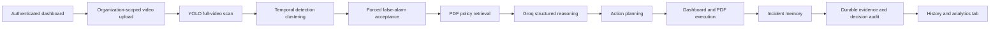

# Architecture

```mermaid
flowchart LR
    UI[Authenticated dashboard] --> Upload[Organization-scoped video upload]
    Upload --> CV[YOLO full-video scan]
    CV --> Cluster[Temporal detection clustering]
    Cluster --> Verify[Forced false-alarm acceptance]
    Verify --> RAG[PDF policy retrieval]
    RAG --> Groq[Groq structured reasoning]
    Groq --> Plan[Action planning]
    Plan --> Execute[Dashboard and PDF execution]
    Execute --> Memory[Incident memory]
    Memory --> Audit[Durable evidence and decision audit]
    Audit --> History[History and analytics tab]
```

Domain and agent code depends on provider-neutral ports. FastAPI, SQLAlchemy, Ultralytics, Groq, PDF generation, and Twilio remain infrastructure adapters.
